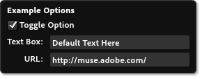
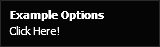
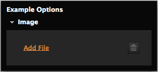

# Parameter Tags
There are several parameter tags available to create the MuCow widget's On-Object UI (OOUI). This is the fly-out menu that allows the user to set certain settings about the widget.

Parameters can then be included in your code, and replaced

## `<text>`

###### Versions Supported: 1+

Specifies a parameter that will be user entered text. This text can be displayed as either a single-line or multi-line entry box in the OOUI. The maximum number of characters allowed in this field is 2048 starting with Muse 2014.0. Prior to this, the maximum was 1024.

### Examples
	<text name="myTextBox" defaultValue="The default value" />

	<text name="myTextBox" defaultValue="The default value" 
		label="A Label" toolTip="This is the toolTip"
		multiline="true" />

### Required Attributes
| Name | Values | Versions Supported | Description |
|---|---|---|---|
| name | Unique String | 1+ | The name of the value. |
| defaultValue | String | 1+ | The default value this item should have when first placed |

### Optional Attributes
| Name | Values | Versions Supported | Description |
|---|---|---|---|
| label | String | 1+ | Label to display in the OOUI |
| toolTip | String | 1+ | Tooltip to display in the OOUI when hovering over this option |
| paramEncoding | `URIComponent`   `spaceToPlus` | 1+ | The type of encoding to apply to the entered parameter |
| multiline | Boolean | 1+ | If set to true a multiline text control will be created in the UI instead of a single line text box. |
| defaultIllegalForOutput | Boolean | 2+ | Will warn the user if the default value is used when exporting or publishing the site |

## `<list>`
Specifies a parameter that a user can select from a set of given options. Options are given using `<value>` tags, which are children of the `<list>` tag. See Child Tags section.

### Examples
	<list name="myList" defaultValue="Second Value" label="My List">
		<value name="first" label="First Value"/>
		<value name="Second Value"/>
		<value name="third_value" label="Last One" disableOptions="myTextBox,myURL"/>
	</list>

### Required Attributes
| Name | Values | Versions Supported | Description |
|---|---|---|---|
| name | Unique String | 1+ | The name of the value. |
| defaultValue | String | 1+ | The default value this item should have when first placed. This must match one of the `name` attributes of a child `<value>` element. |

### Optional Attributes
| Name | Values | Versions Supported | Description |
|---|---|---|---|
| label | String | 1+ | Label to display in the OOUI |
| toolTip | String | 1+ | Tooltip to display in the OOUI when hovering over this option |

### Child tags
#### `<value>`
Specifies a user-selectable value. **NOTE: `<value>` tags can contain [Content Tags][1] which will modify the output.**

##### Required *Child* Attributes
| Name | Values | Versions Supported | Description |
|---|---|---|---|
| name | Unique String | 1+ | Value that will be passed to the final code. |

##### Optional *Child* Attributes
| Name | Values | Versions Supported | Description |
|---|---|---|---|
| label | String | 1+ | A label to display to the user |
| disableOptions | List | 1+ | A comma separated list of name values for options that are disabled when the selected item is this 

## `<url>`

###### Versions Supported: 1+

Specifies the user should enter either a partial or full URL.

### Examples

	<url name="myURL" label="My URL" 
		defaultValue="http://muse.adobe.com/" />

	<url name="myURL" label="My URL" 
		defaultValue="http://muse.adobe.com/" 
		currentPageOrURL="true" />

### Required Attributes
| Name | Values | Versions Supported | Description |
|---|---|---|---|
| name | Unique String | 1+ | The name of the value. |
| defaultValue | String | 1+ | The default value this item should have when first placed. This must match one of the `name` attributes of a child `<value>` element. |

### Optional Attributes
| Name | Values | Versions Supported | Description |
|---|---|---|---|
| label | String | 1+ | Label to display in the OOUI |
| toolTip | String | 1+ | Tooltip to display in the OOUI when hovering over this option |
| urlStart | String | 1+ | A comma separated list of URL prefixes. all entered URLs must start with one of these, or be incomplete URLs. |
| currentPageOrURL | Boolean | 1+ | If set to 'true', user will be able to enter an arbitrary URL, or choose the URL for the current Muse Page. |
| dummyDomainPrefix | String | 1+ | If the user hasn't yet entered a domain name, when generating HTML for the current page, this dummy prefix will be used, along with a <abbr title="Globaly Unique Identifier">GUID</abbr>. |
| defaultIllegalForOutput | Boolean | 2+ | Will warn the user if the default value is used when exporting or publishing the site |

## `<bool>`

###### Versions Supported: 1+

Specifies an option that the user will be able to toggle on/off. Must include the values to use for true & false. One or both values may disable other options. Multiple bool UI elements will be arranged in columns

### Examples
	<bool name="toggleOption" label="Toggle Option" defaultValue="foo">
		<trueVal value="foo"/>
		<falseVal value="bar" disableOptions="myTextBox,myURL"/>
	</bool>

### Required Attributes
| Name | Values | Versions Supported | Description |
|---|---|---|---|
| name | Unique String | 1+ | The name of the value. |
| defaultValue | String | 1+ | The default value this item should have when first placed. This must match one of the `name` attributes of a child element. |

### Optional Attributes
| Name | Values | Versions Supported | Description |
|---|---|---|---|
| label | String | 1+ | Label to display in the OOUI |
| toolTip | String | 1+ | Tooltip to display in the OOUI when hovering over this option |

### Child tags
#### `<trueVal>`
Specifies a value to pass when user turns on this option. **NOTE: `<trueVal>` tags can contain [Content Tags][1] which will modify the output.**

#### `<falseVal>`
Specifies a value to pass when user turns off this option. **NOTE: `<falseVal>` tags can contain [Content Tags][1] which will modify the output.**

##### Required *Child* Attributes
| Name | Values | Versions Supported | Description |
|---|---|---|---|
| value | String | 1+ | Value that will be passed to the final code. |

##### Optional *Child* Attributes
| Name | Values | Versions Supported | Description |
|---|---|---|---|
| disableOptions | List | 1+ | A comma separated list of name values for options that are disabled when the item is in this state. |

## `<number>`

###### Versions Supported: 1+

Specifies the user entered value should be a number

### Examples

	<number name="myNumber" min="1" max="100" step="1" 
		snap="0.1" defaultValue="1" label="Number: "/>

### Required Attributes
| Name | Values | Versions Supported | Description |
|---|---|---|---|
| name | Unique String | 1+ | The name of the value. |
| defaultValue | String | 1+ | The default value this item should have when first placed |
| min | Number | 1+ | The minimum allowed value |
| max | Number | 1+ | The maximum allowed value |

### Optional Attributes
| Name | Values | Versions Supported | Description |
|---|---|---|---|
| label | String | 1+ | Label to display in the OOUI |
| toolTip | String | 1+ | Tooltip to display in the OOUI when hovering over this option |
| step | Number | 1+ | How large a step should be if the user clicks the up or down arrow. Defaults to 1 |
| snap | Number | 1+ | What increment should values snap to. Defaults to 1 |
| digitsPrecision | Number | 1+ | The number of digits to show after the decimal point |

## `<builtIn>`
A built in is a special type that allows you to get values that are specified directly in Adobe Muse. These values are passed in the same as any other parameters, and the name can be any one of the values listed below.

### Attributes
| Name | Values | Description |
|---|---|---|
| name | Type | **Required.** One of the types listed below |
| supportedLocales | List | When the `name` attribute is "locale", this attribute is a comma separated list of locales supported by this MuCow. If the document locale is not one of these, the en_US will be used |
| supportedLanguages | List |  When the `name` attribute is "language", this attribute is a comma separated list of languages supported by this MuCow. If the document language is not one of these languages, the English equivalent will be used instead |

**NOTE:**  The `supportedLocale` and `supportedLangauge` attributes are ignored if the `name` attribute is not `locale` or `language` respectively.

### Types
<dl>
	<dt>
		<code>width</code>
	</dt>
	<dd>
		Page item width in Muse
	</dd>
	<dt>
		<code>height</code>
	</dt>
	<dd>
		Page item height in Muse
	</dd>
	<dt>
		<code>itemUID</code>
	</dt>
	<dd>
		The unique ID that is designated to this page item
	</dd>
	<dt>
		<code>siteUID</code>
	</dt>
	<dd>
		The unique ID that identifies this Muse site
	</dd>
	<dt>
		<code>country</code>
	</dt>
	<dd>
		Country code for the current Muse document (e.g. US, FR, JP)
	</dd>
	<dt>
		<code>language</code>
	</dt>
	<dd>
		Character code for the language of the current Muse document (e.g. en, fr, es)
	</dd>
	<dt>
		<code>locale</code>
	</dt>
	<dd>
		Language and country code for the current Muse document (e.g. en_US, fr_FR, es_ES)
	</dd>
	<dt>
		<code>siteDomain</code>
	</dt>
	<dd>
		v4 and later, the domain in which the site is published to (e.g. muse.adobe.com)
	</dd>
	<dt>
		<code>siteURL</code>
	</dt>
	<dd>
		v4 and later, the url to the site (e.g. http://muse.adobe.com)
	</dd>
	<dt>
		<code>pageTitle</code>
	</dt>
	<dd>
		v4 and later, the title of the page (e.g. "home")
	</dd>
	<dt>
		<code>pageURL</code>
	</dt>
	<dd>
		v4 and later, the url to the page (e.g. http://muse.adobe.com/index.html) similar to the `currentPageOrURL` attribute for the `<URL>` parameter
	</dd>
    
</dl>

## `<info>`

###### Versions Supported: 2+

Informative text to show in the On-Object UI, which can optionally link to a URL.

### Examples

	<info label="You can place informative text here."/>

	<info label="Click Here!" linkURL="http://muse.adobe.com"/>

### Required Attributes
| Name | Values | Versions Supported | Description |
|---|---|---|---|
| label | String | 2+ | The text to display to the user |

### Optional Attributes
| Name | Values | Versions Supported | Description |
|---|---|---|---|
| linkURL | URL | 2+ | The URL to take the user to if the text is clicked |

## `<separator>`

###### Versions Supported: 2+

A line used to separate parameters in the On-Object UI.

### Examples

	<text name="name" label="Name:" defaultValue="You" />
	<separator/>
	<info label="Here's some more content"/>

## `<file>`

###### Versions Supported: 3+

Specifies a parameter that will be a user chosen file. This file will be added as a file for upload.

### Examples

	<file name="img1" label="Choose an Image:"
		filterLabel="Images" fileTypes="*.jpg;*.jpeg;*.png;*.gif"
		fileRequiredForOutput="true"/>

### Required Attributes
| Name | Values | Versions Supported | Description |
|---|---|---|---|
| name | String | 3+ | The name of the value |

### Optional Attributes
| Name | Values | Versions Supported | Description |
|---|---|---|---|
| label | String | 3+ | Label to display in the OOUI |
| toolTip | String | 3+ | Tooltip to display in the OOUI when hovering over this option |
| filterLabel | String | 3+ | Label for filter in the file browse dialog |
| fileTypes | String | 3+ | File types allowed in the file browse dialog. Should be a semicolon-separated list in format "\*.ext;\*.ext2" |
| fileRequiredForOutput | Boolean | 3+ | Will warn the user when exporting or publishing the site if no file was chosen. Defaults to false. |
| asAbsoluteURL | Boolean | 4+ | The result is computed as an absolute (http) URL based on publish settings. |

Starting in v4 of the MuCow format, the `<file>` parameter can resolve with an absolute url to the file if the `asAbsoluteURL` attribute is true. Special care must be taken when the user chooses their publication settings when Muse is not publishing the site on their behalf (i.e. when generating the site to disk.) Muse uses the values entered in these options to build a canonical URL to the file specified.  

## `<color>`

###### Versions Supported: 3+

Specifies a parameter that will be user chosen color. Presented to the user as a color picker in the UI.

### Examples

	<color name="textColor" label="Text Color" defaultValue="#C74040"/>
	<color name="backgroundColor" label="Background Color" rgbColor="true" defaultValue="0, 0, 255"/>

### Required Attributes
| Name | Values | Versions Supported | Description |
|---|---|---|---|
| name | String | 3+ | The name of the value |
| defaultValue | String | 3+ | Can be either hex color or comma separated RGB value. Does not affect output format. Use rgbColor to output comma separated RGB value. |
### Optional Attributes
| Name | Values | Versions Supported | Description |
|---|---|---|---|
| label | String | 3+ | Label to display in the OOUI |
| toolTip | String | 3+ | Tooltip to display in the OOUI when hovering over this option |
| rgbColor | Boolean | 3+ | Color value to be returned as comma separated RGB value. Defaults to false. |
| formatHexColor | Boolean | 3+ | Adds the # character before the hex value. Use when color is used in CSS. Defaults to false. |
| supportsNoneColor | Boolean | 3+ | Allow user to pick the none color swatch. Choosing none will output the word transparent. Defaults to false. |
| transparentOption | String | 3+ | The name of a `<number>` input parameter to use to control transparency.  This Allows the color picker to include a slider to adjust the alpha channel of the color. The named input can later be referenced by the generated code as content to pass as the alpha parameter to rgba(). When specifying a transparentOption, supportsNoneColor must also be set to `true` . |

## `<section>`

###### Versions Supported: 4+

Section is a special parameter tag which allows for related parameters to be grouped together.  The user experience for section tags is a collapsable group with a disclosure arrow.

`<section>` tags should have at least 1 of the child parameter tags listed above but it may not contain any other `<section>` tags.

### Optional Attributes
| Name | Values | Versions Supported | Description |
|---|---|---|---|
| label | String | 4+ | Label to display in the OOUI |
| expanded | Boolean | 4+ | Specifies if the section is initially expanded when the OOUI is displayed for the widget. Defaults to false. | 
| name | Unique String | 4+ | The name of the section.  This name can be used to reference the section from a "disableOptions" attribute of another parameter |

	<bool name="toggleOption" label="Use Background Image" defaultValue="noImage">
		<trueVal value="yesImage"/>
		<falseVal value="noImage" disableOptions="imageSection" />
	</bool>
    <section label="image" expanded="true" name="imageSection" >
        <file fileTypes="*.png;*.jpg;*.jpeg;*.gif" filterLabel="Image Files" label="Image" name="Image" fileRequiedForOutput="true" tooltip="Image"/>
    </section>

 [1]: ./04-Content%20Tags.md
