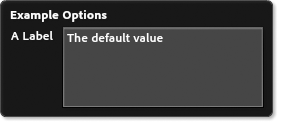
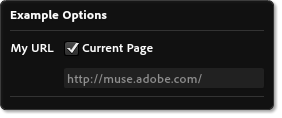
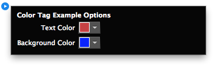

# Etiqueta parameters
Hay varias etiquetas hijos disponibles para usar dentro de la etiqueta `<parameters>` para crear la interfaz OOUI de los widgets MuCow. (OOUI) Es el menú desplegable, que permite al usuario configurar ciertos ajustes sobre el widget.

Estos parámetros pueden ser incluidos en su código, y reemplazados

## `<text>`
Especifica un parámetro que será el texto introducido por el usuario. Este texto se puede mostrar como una sola línea o como cuadro de entrada de varias líneas en el OOUI. El número máximo de caracteres permitidos en este campo es 2048 comenzando con Muse 2014.0. Antes de esto, el máximo fue de 1.024.

### Ejemplos
	<text name="myTextBox" defaultValue="The default value" />

	<text name="myTextBox" defaultValue="The default value" 
		label="A Label" toolTip="This is the toolTip"
		multiline="true" />

### Atributos necesarios
| Nombre | Valores | Descripción |
|---|---|---|---|
| name | Unique String | El nombre del valor. |
| defaultValue | String | Este elemento debe contener un valor predeterminado |

### Atributos opcionales
| Nombre | Valores | Formato mínimo | Descripción |
|---|---|---|---|
| label | String | | Etiqueta que se mostrará en la interfaz OOUI |
| toolTip | String | | Tooltip a mostrar en la interfaz OOUI cuando se cierne sobre esta opción |
| paramEncoding | `URIComponent`   `spaceToPlus` | | El tipo de codificación que se aplica al parámetro introducido |
| multiline | Boolean | | Si se establece como verdadero, se creará un cuadro de texto multi línea en la interfaz de usuario en lugar de un cuadro de texto de una sola línea. |
| defaultIllegalForOutput | Boolean | 2 | Avisará al usuario si el valor predeterminado se utiliza al exportar y publicar el sitio |

## `<list>`
Especifica un parámetro donde el usuario puede elegir entre una serie de opciones que se ofrecen dentro del widget. Las opciones se colocan usando la etiqueta `<value>` que son hijos de las etiquetas `<list>`. Para saber más vea la sección Etiquetas hijos.

### Ejemplos
	<list name="myList" defaultValue="Second Value" label="My List">
		<value name="first" label="First Value"/>
		<value name="Second Value"/>
		<value name="third_value" label="Last One"/>
	</list>

### Atributos necesarios
| Nombre | Valores | Descripción |
|---|---|---|---|
| name | Unique String | El nombre del valor. |
| defaultValue | String | Este elemento debe contener un valor predeterminado. Y debe coincidir con uno de los atributos `name` de la etiqueta hijo `<value>`. |

### Atributos opcionales
| Nombre | Valores | Descripción |
|---|---|---|
| label | String | Etiqueta para mostrar en la interfaz OOUI |
| toolTip | String | ToolTip para mostrar en la interfaz OOUI cuando se cierne sobre esta opción |

### Etiquetas hijos
#### `<value>`
Especifica un valor seleccionable por el usuario. **Nota: las etiquetas `<value>` pueden contener [Etiquetas de Contenido][1] que modificará la salida.**

##### Atributos
| Nombre | Valores | Descripción |
|---|---|---|---|
| name | Unique String | **Valor Requerido** que será pasado al código final. |
| label | String | Una etiqueta para mostrar al usuario |

## `<url>`
Especifica que el usuario debe introducir una dirección URL completa o parcial.

### Ejemplos

	<url name="myURL" label="My URL" 
		defaultValue="http://muse.adobe.com/" />

	<url name="myURL" label="My URL" 
		defaultValue="http://muse.adobe.com/" 
		currentPageOrURL="true" />

### Atributos necesarios
| Nombre | Valores | Descripción |
|---|---|---|---|
| name | Unique String | El nombre del valor. |
| defaultValue | String | Este elemento debe contener un valor predeterminado. Y debe coincidir con uno de los atributos `name` de la etiqueta hijo `<value>`. |

### Atributos opcionales
| Nombre | Valores | Formato mínimo | Descripción |
|---|---|---|---|
| label | String | | Etiqueta que se mostrará en la interfaz OOUI |
| toolTip | String | | ToolTip para mostrar en la interfaz OOUI cuando se cierne sobre esta opción |
| urlStart | String | | Lista de los prefijos URL separados por una coma. todas las URLs introducidas deben empezar con uno de estos, o ser URLs incompletas. |
| currentPageOrURL | Boolean | | Si se establece en 'true', el usuario será capaz de introducir una URL arbitraria, o elegir la dirección actual de la página Muse. |
| dummyDomainPrefix | String | |Si el usuario aún no ha ingresado un nombre de dominio, al generar HTML para la página actual, este prefijo simulado se utilizará, junto con un <abbr title="Globaly Unique Identifier">GUID</abbr>. |
| defaultIllegalForOutput | Boolean | 2 | Avisa al usuario si se utiliza el valor predeterminado cuando exportar o publica el sitio |

## `<bool>`
Especifica una opción que el usuario será capaz de activar o desactivar. Debe incluir los valores a utilizar para la true y false. Uno o ambos valores pueden desactivar otras opciones. Elementos múltiples de la IU bool serán dispuestos en columnas

### Ejemplos
	<bool name="toggleOption" label="Toggle Option" defaultValue="foo">
		<trueVal value="foo"/>
		<falseVal value="bar" disableOptions="myTextBox,myURL"/>
	</bool>

### Atributos necesarios
| Nombre | Valores | Descripción |
|---|---|---|---|
| name | Unique String | El nombre del valor. |
| defaultValue | String |Este elemento debe contener un valor predeterminado. Y debe coincidir con uno de los atributos `name` de la etiqueta hijo `<value>`. |

### Atributos opcionales
| Nombre | Valores | Descripción |
|---|---|---|
| label | String | Etiqueta que se mostrará en la interfaz OOUI |
| toolTip | String | ToolTip para mostrar en la interfaz OOUI cuando se cierne sobre esta opción |

### Etiquetas hijos
#### `<trueVal>`
Especifica un valor a pasar cuando el usuario activa esta opción. **Nota: las etiquetas `<value>` pueden contener [Etiquetas de Contenido][1] que modificará la salida.**

##### Attributes
| Nombre | Valores | Descripción |
|---|---|---|---|
| value | String | **Obligatorio**. Valor que se pasa al final del código. |
| disableOptions | List | Una lista de valores separadas por comas para las opciones que están desactivados cuando el producto está en este estado. |

#### `<falseVal>`
Especifica un valor a pasar cuando el usuario desactiva esta opción. **Nota: las etiquetas `<value>` pueden contener [Etiquetas de Contenido][1] que modificará la salida.**

##### Atributos
| Nombre | Valores | Descripción |
|---|---|---|---|
| value | String | **Obligatorio**. Valor que se pasa al final del código. |
| disableOptions | List |Una lista de valores separadas por comas para las opciones que están desactivados cuando el producto está en este estado. |

## `<number>`
Especifica que el valor a introducir por el usuario debe ser un número

### Ejemplos

	<number name="myNumber" min="1" max="100" step="1" 
		snap="0.1" defaultValue="1" label="Number: "/>

### Atributos necesarios
| Nombre | Valores | Descripción |
|---|---|---|---|
| name | Unique String | El nombre del valor. |
| defaultValue | String | Este elemento debe contener un valor predeterminado |
| min | Number | El valor mínimo permitido |
| max | Number | El valor máximo permitido |

### Atributos opcionales
| Nombre | Valores | Descripción |
|---|---|---|
| label | String | Etiqueta que se mostrará en la interfaz OOUI |
| toolTip | String | Tooltip a mostrar en la interfaz OOUI cuando se cierne sobre esta opción |
| step | Number | Qué tan grande debe ser el paso si el usuario hace clic en la flecha hacia arriba o hacia abajo. El valor predeterminado es 1 |
| snap | Number | Qué incremento debería ajustar el valor. El valor predeterminado es 1 |
| digitsPrecision | Number | El número de dígitos a mostrar después del punto decimal |

## `<builtIn>`
Un built es un tipo especial que le permite obtener los valores que se especifican directamente en Adobe Muse. Estos valores se transmiten a cualquier otro parámetro, el nombre puede ser cualquiera de los valores indicados a continuación.

### Atributos
| Nombre | Valores | Descripción |
|---|---|---|---|
| name | Type | **Obligatorio.** Uno de los tipos enumerados a continuación |
| supportedLocales | List | Lista de idiomas soportados por este MuCow separados por comas. Si el idioma del documento no es uno de estos idiomas, se utilizará en su lugar el equivalente inglés |

### Types
<dl>
	<dt>
		<code>width</code>
	</dt>
	<dd>
		Ancho del elemento de página en Muse
	</dd>
	<dt>
		<code>height</code>
	</dt>
	<dd>
		Altura del elemento de página en Muse
	</dd>
	<dt>
		<code>itemUID</code>
	</dt>
	<dd>
		El identificador único que se designa a este elemento en la página
	</dd>
	<dt>
		<code>siteUID</code>
	</dt>
	<dd>
		El identificador único que identifica a este sitio de Muse
	</dd>
	<dt>
		<code>country</code>
	</dt>
	<dd>
		Código de país para el documento actual Muse (ejemplo. US, FR, JP)
	</dd>
	<dt>
		<code>language</code>
	</dt>
	<dd>
		Código de caracteres para el idioma del documento actual Muse (ejemplo. en, fr, es)
	</dd>
	<dt>
		<code>locale</code>
	</dt>
	<dd>
		Código de idioma y país del documento actual de Muse (ejemplo. en_US, fr_FR, es_ES)
	</dd>
</dl>

## `<info>`
Texto informativo para mostrar en la interfaz OOUI de usuario, que opcionalmente puede enlazar a una dirección URL. **Sólo esta soportado en el formato de widgets 2 o superior**.

### Ejemplos

	<info label="You can place informative text here."/>

	<info label="Click Here!" linkURL="http://muse.adobe.com"/>

### Atributos necesarios
| Nombre | Valores | Descripción |
|---|---|---|---|
| value | String | El texto que se mostrará al usuario |

### Atributos opcionales
| Nombre | Valores | Descripción |
|---|---|---|---|
| linkURL | URL | La URL para permitir al usuario acceder si se hace clic en el texto |

## `<separator>`
Una línea que se utiliza para separar los parámetros en la interfaz OOUI de usuario. **Sólo esta soportado en el formato de widgets 2 o superior**.

### Ejemplo

	<text name="name" label="Name:" defaultValue="You" />
	<separator/>
	<info label="Here's some more content"/>

## `<file>`
Especifica un parámetro que permite al usuario cargar un archivo local. Este archivo se añade como un archivo para carga. **Sólo esta soportado en el formato de widgets 3 o superior**.

### Ejemplo

	<file name="img1" label="Choose an Image:" filterLabel="Images" fileTypes="*.jpg;*.jpeg;*.png;*.gif" fileRequiredForOutput="true"/>

### Atributos necesarios
| Nombre | Valores | Descripción |
|---|---|---|---|
| name | String | El nombre del valor |

### Atributos opcionales
| Nombre | Valores | Descripción |
|---|---|---|---|
| label | String | Etiqueta que se mostrará en la interfaz OOUI |
| filterLabel | String | Etiqueta para el filtro en el cuadro de diálogo de exploración de archivos |
| fileTypes | String | Tipos de archivos permitidos en el cuadro de diálogo de exploración de archivos. Debe ser una lista separada por  comas y el formato del archivo debe contener un punto antes del nombre de la extensión  "\*.ext;\*.ext2" |
| fileRequiredForOutput | Boolean | Le avisará al usuario si no hay ningún archivo elegido cuando exporta o publica el sitio . El valor predeterminado es false. |

## `<color>`
Especifica un parámetro para que el usuario pueda elegir un color. Se presentara al usuario un selector de colores en la interfaz de usuario. **Sólo esta soportado en el formato de widgets 3 o superior**.

### Ejemplos

	<color name="textColor" label="Text Color" defaultValue="#C74040"/>
	<color name="backgroundColor" label="Background Color" rgbColor="true" defaultValue="0, 0, 255"/>

### Atributos necesarios
| Nombre | Valores | Descripción |
|---|---|---|---|
| name | String | El nombre del valor |

### Atributos opcionales
| Nombre | Valores | Descripción |
|---|---|---|---|
| label | String | Etiqueta que se mostrará en la interfaz OOUI |
| defaultValue | String | Puede ser cualquier color hexadecimal o valor RGB separados por comas. Esto no afectara el formato de salida. Usar rgbColor para generar valores RGB separados por comas. |
| rgbColor | Boolean | Valor buleano para establecer colores RGB que se separan por comas. El valor predeterminado es false |
| formatHexColor | Boolean | Valor buleano para establecer colores exadecimales, al igual que en css debe anteponer el signo #. El valor predeterminado es false |
| supportsNoneColor | Boolean | Permite al usuario elegir ninguna muestra de color. La elección de este valor dará como salida un valor "color" transparente. El valor predeterminado es false. |

 [1]: ./04-Content%20Tags.md
