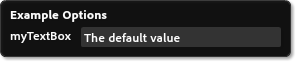
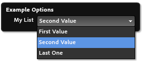
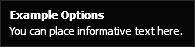
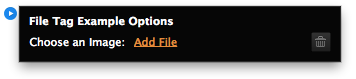

# Etiqueta Parámetros
Hay varias etiquetas de parámetros disponibles para crear los widgets MuCow En-Objeto OUI. (OUI) Es el menú desplegable, que permite al usuario configurar ciertos ajustes sobre el widget.

Estos parámetros pueden ser incluidos en su código, y reemplazados

## `<text>`
Especifica un parámetro que será el texto introducido por el usuario. Este texto se puede mostrar como una sola línea o como cuadro de entrada de varias líneas en el OOUI. El número máximo de caracteres permitidos en este campo es 2048 comenzando con Muse 2014.0. Antes de esto, el máximo fue de 1.024.

### Ejemplos
	<text name="myTextBox" defaultValue="The default value" />

	<text name="myTextBox" defaultValue="The default value" 
		label="A Label" toolTip="This is the toolTip"
		multiline="true" />

### Atributos necesarios
| Nombre | Valores | Descripción |
|---|---|---|---|
| name | Unique String | El nombre del valor. |
| defaultValue | String | Este elemento debe contener un valor predeterminado |

### Atributos opcionales
| Nombre | Valores | Formato mínimo | Descripción |
|---|---|---|---|
| label | String | | Etiqueta que se mostrará en la OOUI |
| toolTip | String | | Tooltip a mostrar en el OOUI cuando se cierne sobre esta opción |
| paramEncoding | `URIComponent`   `spaceToPlus` | | El tipo de codificación que se aplica al parámetro introducido |
| multiline | Boolean | | Si se establece como verdadero, se creará un cuadro de texto multi línea en la interfaz de usuario en lugar de un cuadro de texto de una sola línea. |
| defaultIllegalForOutput | Boolean | 2 | Avisará al usuario si el valor predeterminado se utiliza al exportar y publicar el sitio |

## `<list>`
Especifica un parámetro donde el usuario puede elegir entre una serie de opciones que se ofrecen dentro del widget. Las opciones se colocan usando la etiqueta `<value>` que son hijos de las etiquetas `<list>`. Para saber más vea la sección Etiquetas hijos.

### Ejemplos
	<list name="myList" defaultValue="Second Value" label="My List">
		<value name="first" label="First Value"/>
		<value name="Second Value"/>
		<value name="third_value" label="Last One"/>
	</list>

### Atributos necesarios
| Nombre | Valores | Descripción |
|---|---|---|---|
| name | Unique String | El nombre del valor. |
| defaultValue | String | Este elemento debe contener un valor predeterminado. Y debe coincidir con uno de los atributos `name` de la etiqueta hijo `<value>`. |

### Optional Attributes
| Name | Values | Description |
|---|---|---|
| label | String | Label to display in the OOUI |
| toolTip | String | Tooltip to display in the OOUI when hovering over this option |

### Child tags
#### `<value>`
Specifies a user-selectable value. **NOTE: `<value>` tags can contain [Content Tags][1] which will modify the output.**

##### Attributes
| Name | Values | Description |
|---|---|---|---|
| name | Unique String | **REQUIRED** Value that will be passed to the final code. |
| label | String | A label to display to the user |

## `<url>`
Specifies the user should enter either a partial or full URL.

### Examples

	<url name="myURL" label="My URL" 
		defaultValue="http://muse.adobe.com/" />

	<url name="myURL" label="My URL" 
		defaultValue="http://muse.adobe.com/" 
		currentPageOrURL="true" />

### Required Attributes
| Name | Values | Description |
|---|---|---|---|
| name | Unique String | The name of the value. |
| defaultValue | String | The default value this item should have when first placed. This must match one of the `name` attributes of a child `<value>` element. |

### Optional Attributes
| Name | Values | Minimum Format | Description |
|---|---|---|---|
| label | String | | Label to display in the OOUI |
| toolTip | String | | Tooltip to display in the OOUI when hovering over this option |
| urlStart | String | | A comma separated list of URL prefixes. all entered URLs must start with one of these, or be incomplete URLs. |
| currentPageOrURL | Boolean | | If set to 'true', user will be able to enter an arbitrary URL, or choose the URL for the current Muse Page. |
| dummyDomainPrefix | String | | If the user hasn't yet entered a domain name, when generating HTML for the current page, this dummy prefix will be used, along with a <abbr title="Globaly Unique Identifier">GUID</abbr>. |
| defaultIllegalForOutput | Boolean | 2 | Will warn the user if the default value is used when exporting or publishing the site |

## `<bool>`
Specifies an option that the user will be able to toggle on/off. Must include the values to use for true & false. One or both values may disable other options. Multiple bool UI elements will be arranged in columns

### Examples
	<bool name="toggleOption" label="Toggle Option" defaultValue="foo">
		<trueVal value="foo"/>
		<falseVal value="bar" disableOptions="myTextBox,myURL"/>
	</bool>

### Required Attributes
| Name | Values | Description |
|---|---|---|---|
| name | Unique String | The name of the value. |
| defaultValue | String | The default value this item should have when first placed. This must match one of the `name` attributes of a child element. |

### Optional Attributes
| Name | Values | Description |
|---|---|---|
| label | String | Label to display in the OOUI |
| toolTip | String | Tooltip to display in the OOUI when hovering over this option |

### Child tags
#### `<trueVal>`
Specifies a value to pass when user turns on this option. **NOTE: `<trueVal>` tags can contain [Content Tags][1] which will modify the output.**

##### Attributes
| Name | Values | Description |
|---|---|---|---|
| value | String | **Required.** Value that will be passed to the final code. |
| disableOptions | List | A comma separated list of name values for options that are disabled when the item is in this state. |

#### `<falseVal>`
Specifies a value to pass when user turns off this option. **NOTE: `<falseVal>` tags can contain [Content Tags][1] which will modify the output.**

##### Attributes
| Name | Values | Description |
|---|---|---|---|
| value | String | **Required.** Value that will be passed to the final code. |
| disableOptions | List | A comma separated list of name values for options that are disabled when the item is in this state. |

## `<number>`
Specifies the user entered value should be a number

### Examples

	<number name="myNumber" min="1" max="100" step="1" 
		snap="0.1" defaultValue="1" label="Number: "/>

### Required Attributes
| Name | Values | Description |
|---|---|---|---|
| name | Unique String | The name of the value. |
| defaultValue | String | The default value this item should have when first placed |
| min | Number | The minimum allowed value |
| max | Number | The maximum allowed value |

### Optional Attributes
| Name | Values | Description |
|---|---|---|
| label | String | Label to display in the OOUI |
| toolTip | String | Tooltip to display in the OOUI when hovering over this option |
| step | Number | How large a step should be if the user clicks the up or down arrow. Defaults to 1 |
| snap | Number | What increment should values snap to. Defaults to 1 |
| digitsPrecision | Number | The number of digits to show after the decimal point |

## `<builtIn>`
A built in is a special type that allows you to get values that are specified directly in Adobe Muse. These values are passed in the same as any other parameters, and the name can be any one of the values listed below.

### Attributes
| Name | Values | Description |
|---|---|---|---|
| name | Type | **Required.** One of the types listed below |
| supportedLocales | List | Comma separated list of languages supported by this MuCow. If the document language is not one of these languages, the English equivalent will be used instead |

### Types
<dl>
	<dt>
		<code>width</code>
	</dt>
	<dd>
		Page item width in Muse
	</dd>
	<dt>
		<code>height</code>
	</dt>
	<dd>
		Page item height in Muse
	</dd>
	<dt>
		<code>itemUID</code>
	</dt>
	<dd>
		The unique ID that is designated to this page item
	</dd>
	<dt>
		<code>siteUID</code>
	</dt>
	<dd>
		The unique ID that identifies this Muse site
	</dd>
	<dt>
		<code>country</code>
	</dt>
	<dd>
		Country code for the current Muse document (e.g. US, FR, JP)
	</dd>
	<dt>
		<code>language</code>
	</dt>
	<dd>
		Character code for the language of the current Muse document (e.g. en, fr, es)
	</dd>
	<dt>
		<code>locale</code>
	</dt>
	<dd>
		Language and country code for the current Muse document (e.g. en_US, fr_FR, es_ES)
	</dd>
</dl>

## `<info>`
Informative text to show in the On-Object UI, which can optionally link to a URL. **Only supported by widgets format 2 or above.**

### Examples

	<info label="You can place informative text here."/>

	<info label="Click Here!" linkURL="http://muse.adobe.com"/>

### Required Attributes
| Name | Values | Description |
|---|---|---|---|
| value | String | The text to display to the user |

### Optional Attributes
| Name | Values | Description |
|---|---|---|---|
| linkURL | URL | The URL to take the user to if the text is clicked |

## `<separator>`
A line used to separate parameters in the On-Object UI. **Only supported by widgets format 2 or above.**

### Examples

	<text name="name" label="Name:" defaultValue="You" />
	<separator/>
	<info label="Here's some more content"/>

## `<file>`
Specifies a parameter that will be a user chosen file. This file will be added as a file for upload. **Only supported by widgets format 3 or above.**

### Examples

	<file name="img1" label="Choose an Image:" filterLabel="Images" fileTypes="*.jpg;*.jpeg;*.png;*.gif" fileRequiredForOutput="true"/>

### Required Attributes
| Name | Values | Description |
|---|---|---|---|
| name | String | The name of the value |

### Optional Attributes
| Name | Values | Description |
|---|---|---|---|
| label | String | Label to display in the OOUI |
| filterLabel | String | Label for filter in the file browse dialog |
| fileTypes | String | File types allowed in the file browse dialog. Should be a semicolon-separated list in format "\*.ext;\*.ext2" |
| fileRequiredForOutput | Boolean | Will warn the user when exporting or publishing the site if no file was chosen. Defaults to false. |

## `<color>`
Specifies a parameter that will be user chosen color. Presented to the user as a color picker in the UI. **Only supported by widgets format 3 or above.**

### Examples

	<color name="textColor" label="Text Color" defaultValue="#C74040"/>
	<color name="backgroundColor" label="Background Color" rgbColor="true" defaultValue="0, 0, 255"/>

### Required Attributes
| Name | Values | Description |
|---|---|---|---|
| name | String | The name of the value |

### Optional Attributes
| Name | Values | Description |
|---|---|---|---|
| label | String | Label to display in the OOUI |
| defaultValue | String | Can be either hex color or comma separated RGB value. Does not affect output format. Use rgbColor to output comma separated RGB value. |
| rgbColor | Boolean | Color value to be returned as comma separated RGB value. Defaults to false. |
| formatHexColor | Boolean | Adds the # character before the hex value. Use when color is used in CSS. Defaults to false. |
| supportsNoneColor | Boolean | Allow user to pick the none color swatch. Choosing none will output the word transparent. Defaults to false. |

 [1]: ./04-Content%20Tags.md
